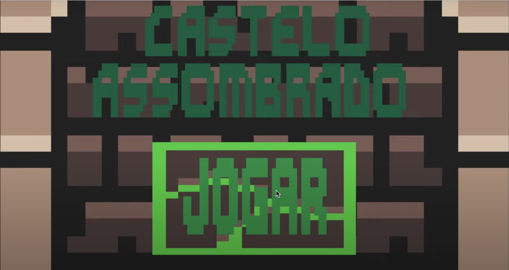
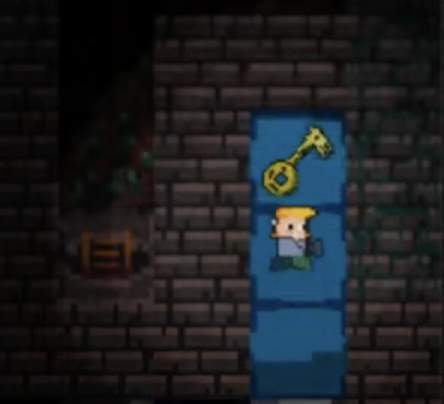
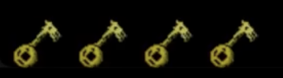
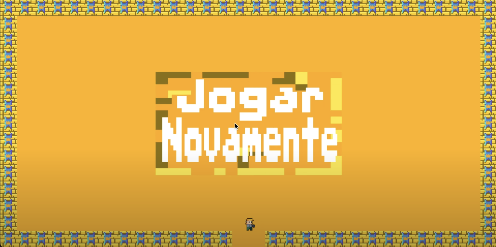

# Build Instructions

Para construir e executar o jogo "Castelo Assombrado", siga as instruções abaixo:

## Pré-requisitos

- **Python 3.x**: Certifique-se de ter o Python instalado na sua máquina. Você pode baixar a versão mais recente do Python no site oficial do Python.
- **Pygame**: Biblioteca necessária para gráficos e manipulação de sprites.

### Instalação

1. **Clone o repositório:**

   Para começar, clone o repositório do projeto usando Git. Navegue até o diretório onde deseja clonar o projeto e execute o comando no terminal:

   `git clone https://github.com/yuritaba/pygame_opendev.git`

   Depois, entre na pasta do projeto:

   `cd pygame_opendev`

3. **Instale as dependências:**

   Instale o Pygame manualmente com:

   `pip install pygame`

### Executando o Jogo

1. **Iniciar o Jogo:**

   Execute o arquivo principal para iniciar o jogo com:

   `python3 jogo.py` ou `python jogo.py`

   No menu principal, clique em "JOGAR"

   

2. **Controles do Jogo:**

   - **Movimentação**: Use as setas do teclado para mover o personagem.
   
   - **Coletar Itens**: Passe por cima dos itens (chaves e outros objetos) para coletá-los. Quatro chaves são necessárias para sair do castelo.
   
   
   - **Interação com Alçapões**: Ao passar sobre um alçapão, o jogador é teletransportado para outro ponto do mapa.
   - **Vitória**: Ao vencer o jogo a seguinte tela aparecerá. (Clique em "jogar novamente" para jogar novamente)
   

3. **Encerrando o Jogo:**

   Para encerrar o jogo, feche a janela clicando no botão 'X' no canto superior direito da tela.

### Jogar Novamente

- Caso o personagem morra ao ser tocado por um monstro, o jogo termina, e um botão "Jogar Novamente" aparecerá na tela para reiniciar o jogo.

### Resolução de Problemas

- **Erro de Importação**: Se ocorrer um erro de importação, verifique se o ambiente virtual está ativado e se todas as dependências foram instaladas corretamente.
- **Pygame não Inicia**: Certifique-se de que seu Python e Pygame estejam na versão correta e compatíveis entre si. Reinstale o Pygame se necessário.
- **Baixo Desempenho**: Para melhorar o desempenho, certifique-se de que sua máquina atende aos requisitos mínimos de hardware para executar jogos em Python com Pygame.

Essas instruções devem ajudar a garantir que o jogo "Castelo Assombrado" seja configurado e executado corretamente. Se encontrar problemas adicionais, consulte a seção de ajuda na documentação ou abra um issue no repositório do GitHub.